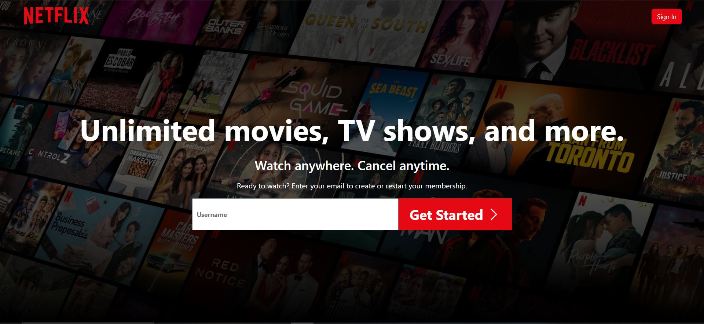
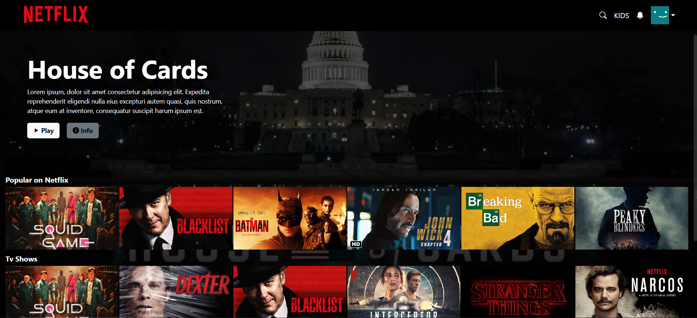

# Netflix Clone

## Website [https://netflixwebclone.web.app/](https://netflixwebclone.web.app/)<br/>

**Made by por Josevânio António / Feito por Josevânio António**

### Netflix website clone / Clone do website da Netflix

Despite not being complete, the project allows for a temporary login.<br/>
_Apesar de não estar completo, o projecto permite fazer um login temporário.<br/>_

Tools used:<br/>
_Ferramentas usadas:<br/>_

Firebase<br/>
Animate<br/>
Bootstrap<br/>
Bootstrap-icons<br/>
Next JS<br/>
React<br/>
Swiper<br/>

To open the program on your computer in developer mode [http://localhost:3000](http://localhost:3000):<br/>
Clone and use the commands below<br/>

_Para abrir o programa no seu computador no modo desenvolvedor [http://localhost:3000](http://localhost:3000):<br/>_
_Faça o clone e use os comandos abaixo<br/>_

```bash
npm install
# ou
yarn add

npm run dev
# ou
yarn dev
```

## Main page

## _Página principal_



## User page

## _Página do usuário_


